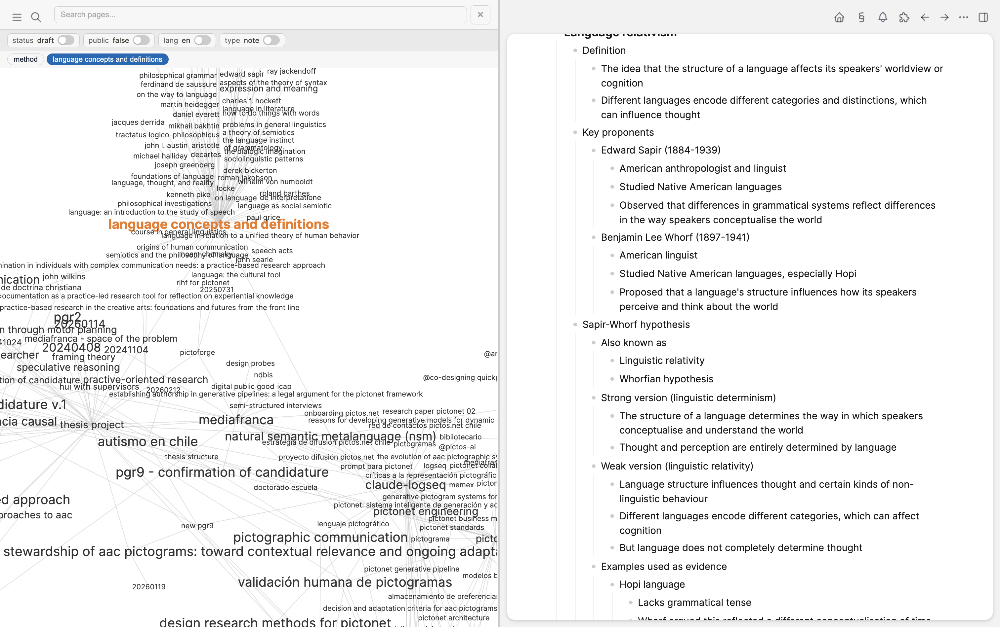

# Con§tel

A split-view plugin for [LogSeq](https://logseq.com) that displays an interactive force-directed graph alongside the native editor. Navigate your knowledge graph visually — click a node and the page opens beside it.



## Features

- **Split view** — resizable D3 graph (left) + LogSeq editor (right); drag the divider to adjust
- **Graph navigation** — click any node to open its page; the graph re-centers around it
- **Two node styles** — classic circle nodes or collision-aware title labels sized by page length
- **Page search** — autocomplete search bar to jump to any page instantly
- **Navigation history** — breadcrumb pills tracking visited pages, with orange highlights on graph nodes
- **Property filters** — toggle switches for page properties (status, tags, type…) to filter the visible graph
- **Theme integration** — automatically detects dark/light mode, reads your theme's font family and colors, and switches live when you change themes
- **Hover highlight** — dims unconnected nodes to reveal direct relationships
- **Drag & zoom** — pan, scroll-zoom, and drag individual nodes

## Getting started

### From the marketplace

Search for **Con§tel** in LogSeq → Plugins → Marketplace.

### Manual install

```bash
git clone https://github.com/hspencer/logseq-constel.git
cd logseq-constel
npm install
npm run build
```

In LogSeq: **Settings → Advanced → Developer mode**, then **Plugins → Load unpacked plugin** and select the `logseq-constel` folder.

## Usage

| Action | How |
|---|---|
| Toggle the view | Click the **§** toolbar button, or press **Ctrl+Cmd+C** (Mac) / **Ctrl+Alt+C** |
| Close | Press **Esc** or click the **×** button |
| Navigate | Click any node in the graph |
| Search | Type in the search bar (top-left) |
| Resize | Drag the vertical divider between graph and editor |
| Zoom | Scroll wheel over the graph |
| Pan | Click and drag on the graph background |

## Settings

Open LogSeq → Plugins → Con§tel → Settings:

| Setting | Default | Options | Description |
|---|---|---|---|
| **Graph depth** | `2` | 1–5 | Degrees of separation from the current page. `1` = direct connections only, `2` = friends-of-friends, etc. |
| **Node style** | `circular` | `circular` · `title` | **Circular**: classic dot nodes with labels. **Title**: text-only labels that physically collide — font size reflects page length. |
| **Repulsion force** | `-200` | any negative number | How strongly nodes push each other apart. More negative = more spread out. |
| **Link distance** | `80` | pixels | Ideal distance between connected nodes. Increase for a more spacious layout. |

## Stack

- **TypeScript** + **Vite**
- **D3.js v7** — force-directed simulation with custom rectangular collision
- **LogSeq Plugin API** (`@logseq/libs`)

## License

[MIT](./LICENSE)
